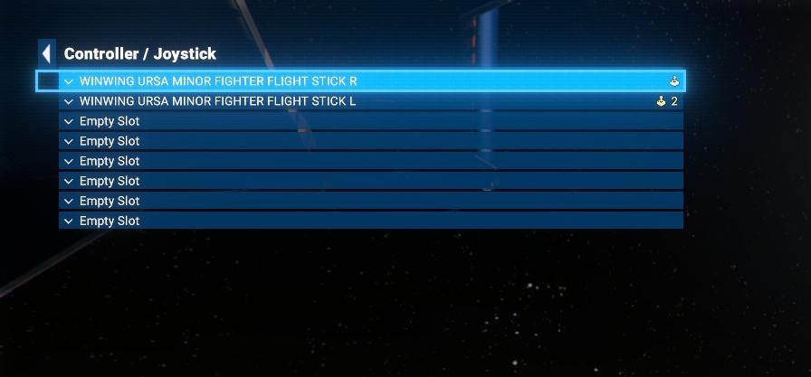
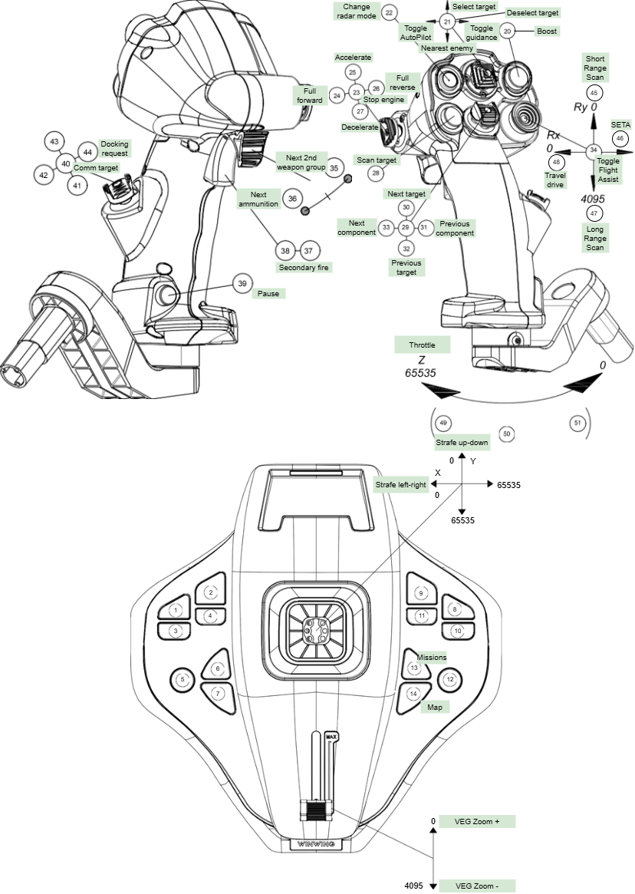
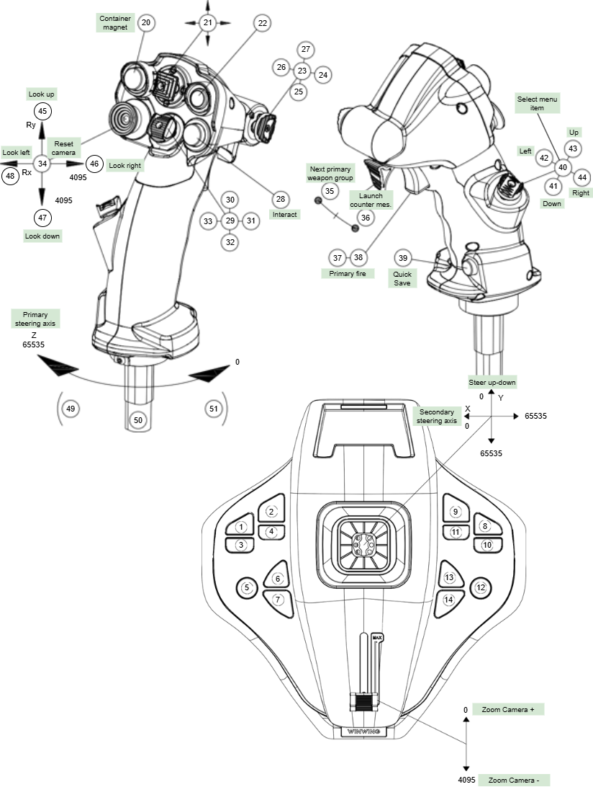

# X4: Foundations WINWING Ursa Minor Dual controller Configuration

## Introduction

This is my personal dual stick configuration of the [WINWING Ursa Minor](https://winwingsim.com/view/goods-details.html?id=725) joysticks for [X4: Foundations by Egosoft](https://www.egosoft.com).

I am using URSA MINOR Space Joystick L and URSA MINOR Fighter Joystick R. "Space" and "Fighter" controllers have exactly the same button layout. The only difference is that "Fighter" is in vertical configuration, and "Space" is in Omni Throttle configuration. So you can replace "Space" controller with "Fighter" or vise versa, and the configuration will still work.

## Instructions

### X4: Foundations

Place the input map file in your `Documents\Egosoft\X4\<user-id>\` folder.  Rename the file to `inputmap_#.xml` where the number is a number 1-5.  For best results use a number that is currently not being used by other input maps.

The input map covers both right and left sticks.

The game recognizes both controllers as FIGHTER FLIGHT STICK. It doesn't matter. As stated before, "Space" and "Fighter" controllers have exactly the same button layout.

Flight stick (in my case, right hand) should be set as controller 1.

Throttle stick (in my case, left hand) should be set as controller 2.

In the X4 Controls menu use the Load Profile option to load the new configuration.

## Stick Configurations
### Left Stick Diagram

### Right Stick Diagram

## Changelog

- 2025.11.16 -- Initial Release
